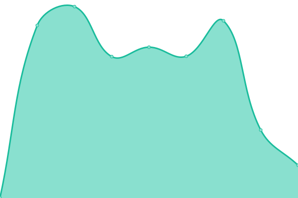
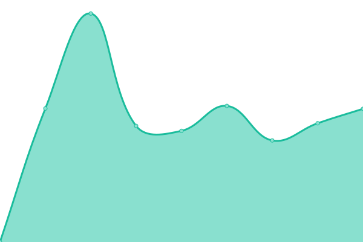

# [📈 Live Status](https://phungtd.github.io/upptime): <!--live status--> **🟧 Partial outage**

This repository contains the open-source uptime monitor and status page for [Phụng Trần](https://phungtd.github.io/upptime), powered by [Upptime](https://github.com/upptime/upptime).

With [Upptime](https://upptime.js.org), you can get your own unlimited and free uptime monitor and status page, powered entirely by a GitHub repository. We use [Issues](https://github.com/phungtd/upptime/issues) as incident reports, [Actions](https://github.com/phungtd/upptime/actions) as uptime monitors, and [Pages](https://phungtd.github.io/upptime) for the status page.

<!--start: status pages-->
<!-- This summary is generated by Upptime (https://github.com/upptime/upptime) -->
<!-- Do not edit this manually, your changes will be overwritten -->
<!-- prettier-ignore -->
| URL | Status | History | Response Time | Uptime |
| --- | ------ | ------- | ------------- | ------ |
|  [bk8.sarl](https://bk8.sarl) | 🟩 Up | [bk8-sarl.yml](https://github.com/phungtd/upptime/commits/HEAD/history/bk8-sarl.yml) | 

 4347ms
     
 | 

<a href="https://uptime.web7m.com/history/bk8-sarl">99.53%</a>
    

|  [scoreahit.com](https://scoreahit.com) | 🟩 Up | [scoreahit-com.yml](https://github.com/phungtd/upptime/commits/HEAD/history/scoreahit-com.yml) | 

 2662ms
     
 | 

<a href="https://uptime.web7m.com/history/scoreahit-com">99.01%</a>
    

|  [luck8a.net](https://luck8a.net) | 🟥 Down | [luck8a-net.yml](https://github.com/phungtd/upptime/commits/HEAD/history/luck8a-net.yml) | 

 763ms
     
 | 

<a href="https://uptime.web7m.com/history/luck8a-net">0.00%</a>
    

|  [qh88com.tel](https://qh88com.tel) | 🟩 Up | [qh88com-tel.yml](https://github.com/phungtd/upptime/commits/HEAD/history/qh88com-tel.yml) | 

 1667ms
     
 | 

<a href="https://uptime.web7m.com/history/qh88com-tel">99.22%</a>
    

<!--end: status pages-->

[**Visit our status website →**](https://phungtd.github.io/upptime)

## 📄 License

- Powered by: [Upptime](https://github.com/upptime/upptime)
- Code: [MIT](./LICENSE) © [Anand Chowdhary](https://anandchowdhary.com), supported by [Pabio](https://pabio.com)
- Data in the `./history` directory: [Open Database License](https://opendatacommons.org/licenses/odbl/1-0/)
